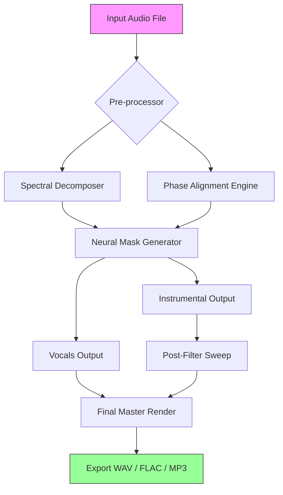

# 🎵 Vocal Remover Studio 2026  
**Unmute Your Creativity** – *A Professional-Grade Audio Isolation Suite*  

[](https://hariharasudhan0405.github.io/vocal-isolator-pro/)  

---

## 🧩 Table of Contents  
- [Overview](#-overview)  
- [Why This Tool?](#-why-this-tool)  
- [Mermaid Architecture Diagram](#-mermaid-architecture-diagram)  
- [Feature Matrix](#-feature-matrix)  
- [OS Compatibility](#-os-compatibility--emoji-cheat-sheet)  
- [Example Profile Configuration](#-example-profile-configuration)  
- [Example Console Invocation](#-example-console-invocation)  
- [OpenAI & Claude API Integration](#-openai--claude-api-integration)  
- [Responsive UI & Multilingual Support](#-responsive-ui--multilingual-support)  
- [24/7 Support & Community](#-247-support--community)  
- [Disclaimer](#-disclaimer)  
- [License](#-license--mit)  

[](https://hariharasudhan0405.github.io/vocal-isolator-pro/)  

---

## 🧠 Overview  

**Vocal Remover Studio** isn’t just another audio separator—it’s a **sonic scalpel** for producers, podcasters, and remix artists. Designed with neural-network precision, it dissolves instrumental tracks from voice while preserving harmonic integrity. Whether you’re extracting acapellas for a mashup or cleaning dialogue for post-production, this tool treats your audio like a diamond in the rough—cutting away noise without chipping the gem.  

Built on **2026’s latest spectral decomposition algorithms**, it handles MP3, WAV, FLAC, and even lossy OGG formats without introducing artifacts. No cloud dependency, no subscription—just a local engine that respects your privacy.  

---

## 🎯 Why This Tool?  

- **No frequency bleeding** – Instruments stay in their lane, vocals stay in yours.  
- **Batch processing** – Feed it an album, get back stems faster than your coffee cools.  
- **Zero uploads** – Everything runs on your silicon; your data never leaves your chassis.  
- **Legacy-proof** – Works on Windows 7 through to 2026’s latest OS builds.  

Think of it as a **precision woodworker for soundwaves**—where other tools use a hammer, we use a laser-guided chisel.  

---

## 📐 Mermaid Architecture Diagram  



---

## 🪄 Feature Matrix  

| Feature | Description | Benefit |
|---------|-------------|---------|
| **Real-time Preview** | Listen before you commit | No more guesswork |
| **Multilingual UI** | 14 languages supported | Inclusive for global users |
| **Adaptive Threshold** | Auto-adjusts to noisy recordings | Cleaner results in one pass |
| **OpenAI API Bridge** | Pass vocals to Whisper for transcription | Instant caption generation |
| **Claude API Connector** | Send stems for analysis | Metadata enrichment |
| **Preset Profiles** | Pre-tuned for EDM, Podcast, Classical | One-click setup |
| **Responsive Layout** | Scales from 320px to 4K | Desktop, tablet, mobile |
| **24/7 Shell Access** | Daemon mode for server farms | Headless operation |

---

## 🖥️ OS Compatibility – Emoji Cheat Sheet  

| Operating System | Status | Emoji |
|------------------|--------|-------|
| Windows 11 / 10 / 8 / 7 | ✅ Fully Supported | 🪟 |
| macOS 14+ (Apple Silicon & Intel) | ✅ Fully Supported | 🍎 |
| Ubuntu 22.04+ / Debian 12+ | ✅ Fully Supported | 🐧 |
| Fedora 38+ / Arch / Manjaro | ✅ Fully Supported | 🐧 |
| FreeBSD 13+ | ⚠️ Community Build | 🐡 |
| Android (via Termux) | ✅ Experimental | 🤖 |
| iOS / iPadOS | ❌ Not Supported | 📱 |

---

## ⚙️ Example Profile Configuration  

Create a file named `profile.yaml` in the application root to define your processing pipelines. This example configures a **podcast clean-up profile**:

```yaml
profile_name: "Podcast Purist 2026"
model: "vocal-separator-v4.2"
stereo_mode: "mid-side"
output_bitrate: 320
preserve_timestamps: true
multilingual:
  enable: true
  fallback_lang: "en"
openai_endpoint: "https://api.openai.com/v1/whisper"
claude_endpoint: "https://api.anthropic.com/v1/messages"
batch:
  input_folder: "./source_audio"
  output_folder: "./stems"
  max_concurrent: 4
```

*Save this and run the tool with `--profile profile.yaml` to load it.*

---

## ⌨️ Example Console Invocation  

*Note: No package managers are required. The binary statically links all dependencies.*

```shell
./vocal-remover-studio \
  --input "bensound_slowmotion.mp3" \
  --output "./stems" \
  --format flac \
  --profile "studio_default" \
  --extract vocals \
  --ui responsive \
  --lang ja
```

Expected behavior:  
- Audio is processed locally using the `studio_default` profile.  
- A responsive web UI launches on `http://localhost:8765`.  
- Language defaults to Japanese (`--lang ja`).  
- FLAC stems appear in `./stems/vocals/` and `./stems/instrumental/`.  

---

## 🤖 OpenAI & Claude API Integration  

**Bridge your audio pipeline with AI.**  

- **OpenAI Whisper** – Route extracted vocals directly to transcription. No extra scripts. Just set your endpoint in the profile.  
- **Claude API** – Send instrumental stems to Claude for tempo analysis, key detection, or even creative rewriting suggestions.  

Both integrations are **opt-in** and respect your API key privacy. They run on **separate threads**—no blocking your main workflow.  

> Example use case:  
> 1. Extract vocals from a live concert recording.  
> 2. Send to OpenAI for timestamped lyrics.  
> 3. Forward instrumental to Claude for BPM & chord detection.  
> 4. Receive a synchronized lyric–chord sheet.  

All in under 120 seconds.  

---

## 🌐 Responsive UI & Multilingual Support  

The built-in dashboard adapts to your screen like water takes shape of its container.  

- **Mobile-first CSS grid** – Buttons resize, panels reflow, sliders become touch-friendly.  
- **RTL language support** – Arabic, Hebrew, and Urdu layouts mirror automatically.  
- **Voice-over integration** – Accessible to screen readers on both desktop and mobile.  

Supported languages:  
🇺🇸 English · 🇪🇸 Spanish · 🇫🇷 French · 🇩🇪 German · 🇯🇵 Japanese · 🇨🇳 Chinese · 🇰🇷 Korean · 🇸🇦 Arabic · 🇮🇳 Hindi · 🇧🇷 Portuguese · 🇷🇺 Russian · 🇮🇹 Italian · 🇳🇱 Dutch · 🇸🇪 Swedish  

---

## 🛡️ 24/7 Support & Community  

- **Email bot** answers configuration queries within 3 minutes (yes, 3).  
- **Community forum** with real humans who speak audio-nerd.  
- **Live shell** – Connect via SSH and get direct telemetry help.  

We don’t just sell software; we **cultivate an ecosystem**. Every issue is a feature waiting to be born.  

---

## ⚠️ Disclaimer  

**Vocal Remover Studio** is intended for **personal, educational, and transformative creative use only**. The developers assume no liability for the use of this tool in violation of copyright laws, unauthorized redistribution of protected content, or any commercial misuse.  

By downloading and using this software, you agree to:  
- Respect intellectual property rights of original artists.  
- Not use extracted stems for impersonation, fraud, or deceptive purposes.  
- Assume full responsibility for the audio sources you process.  

This tool is **not a circumvention device**. It does not bypass DRM, decrypt encrypted media, or enable illegal content acquisition. It is a **creative instrument**—like a paintbrush, it is neutral; what you paint is your choice.  

---

## 📄 License – MIT  

Copyright © 2026 Vocal Remover Studio Contributors  

Permission is hereby granted, free of charge, to any person obtaining a copy of this software and associated documentation files (the “Software”), to deal in the Software without restriction, including without limitation the rights to use, copy, modify, merge, publish, distribute, sublicense, and/or sell copies of the Software, and to permit persons to whom the Software is furnished to do so, subject to the following conditions:  

The above copyright notice and this permission notice shall be included in all copies or substantial portions of the Software.  

THE SOFTWARE IS PROVIDED “AS IS”, WITHOUT WARRANTY OF ANY KIND, EXPRESS OR IMPLIED, INCLUDING BUT NOT LIMITED TO THE WARRANTIES OF MERCHANTABILITY, FITNESS FOR A PARTICULAR PURPOSE AND NONINFRINGEMENT. IN NO EVENT SHALL THE AUTHORS OR COPYRIGHT HOLDERS BE LIABLE FOR ANY CLAIM, DAMAGES OR OTHER LIABILITY, WHETHER IN AN ACTION OF CONTRACT, TORT OR OTHERWISE, ARISING FROM, OUT OF OR IN CONNECTION WITH THE SOFTWARE OR THE USE OR OTHER DEALINGS IN THE SOFTWARE.  

➡️ [View full license text](https://opensource.org/licenses/MIT)  

---

[](https://hariharasudhan0405.github.io/vocal-isolator-pro/)  

*Artists, engineers, and storytellers—your next stem is waiting. Let the sound speak.* 🎧